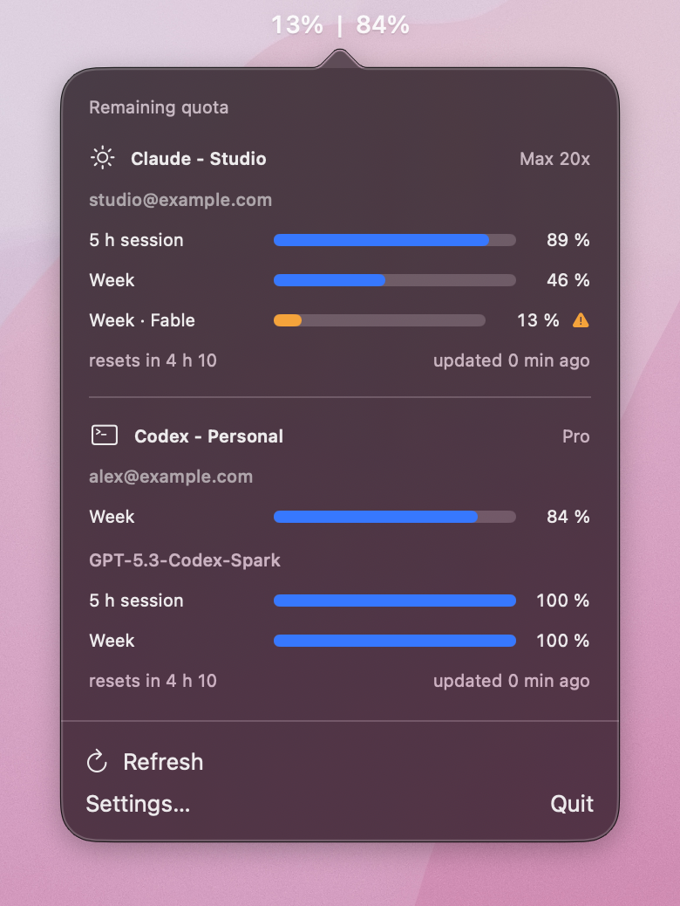
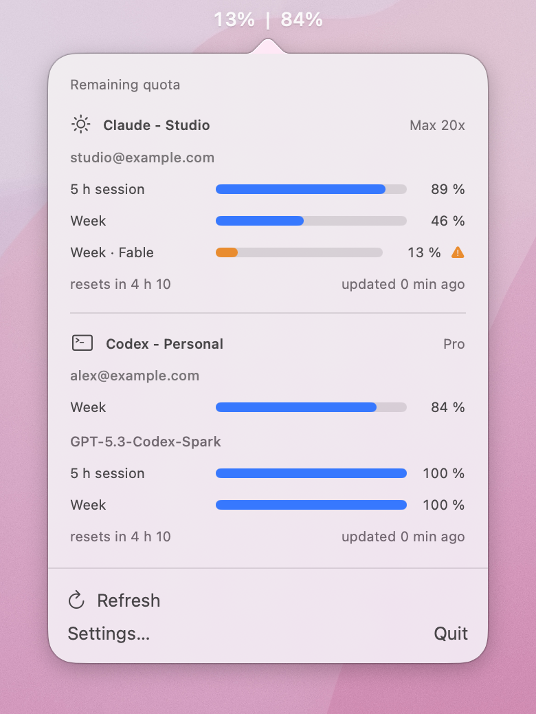
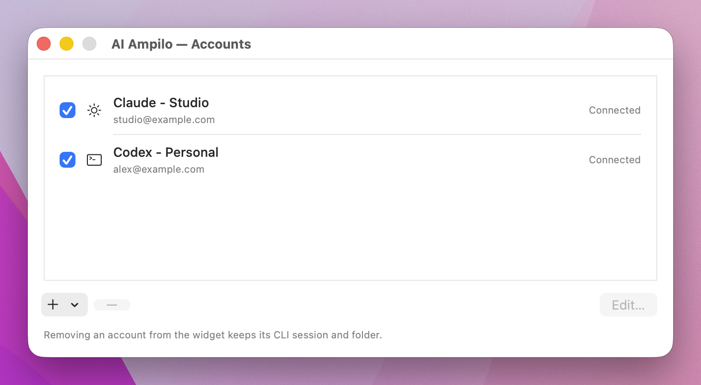

# AI Ampilo

**Your AI quotas in the macOS menu bar, just like a battery.**

AI Ampilo shows how much allowance you have left on your Claude Code and Codex subscriptions, with experimental support for Gemini CLI, Grok Build, Copilot CLI, and Cursor CLI. Click the menu bar to see every quota window and its next reset.

If a quota is 87% used, the widget shows **13% remaining**.

<p align="center">
  
</p>

<p align="center"><sub>Your quotas, right in the macOS menu bar.<br>Native windows on the desktop, with fictional accounts and email addresses.</sub></p>

<details>
  <summary>See the light appearance</summary>
  <p align="center">
    
  </p>
</details>

Built with Swift and SwiftUI for **macOS 14 or later**, with no third-party runtime dependencies. An independent project released under the [MIT license](LICENSE).

Current builds still use the filename `AIUsage.app` and appear as “AI Usage” in macOS. The commands and paths below match these builds.

## Features

- **One value per account** in the menu bar, separated by `|`: the lowest remaining percentage across that account’s quota windows.
- Every quota window in the panel: session, weekly, model-specific, or subscription allowance, depending on the provider.
- Multiple Claude and Codex accounts with custom names, such as “Claude - Work” and “Claude - Personal”.
- Configurable refresh interval, last-known values during network outages, and refresh after waking from sleep.
- Optional alerts at 20% remaining and when a quota is exhausted, disabled by default.
- Launch at login, light and dark appearances.
- Six languages: English, French, Italian, Spanish, German, and Brazilian Portuguese.

The widget tracks **subscription allowance**, which may be shared with other tools from the same provider. It does not measure only the tokens used in your terminal, and it is not an API billing tracker.

## Providers

| Provider    | Quota information                                                           | Accounts                                               | Status                     |
|-------------|-----------------------------------------------------------------------------|--------------------------------------------------------|----------------------------|
| Claude Code | Session, weekly, and model-specific windows; optional extra credits         | Multiple, using separate CLI configuration directories | Tested with a real session |
| Codex CLI   | All windows returned by `app-server`                                        | Multiple, using separate CLI configuration directories | Tested with a real session |
| Gemini CLI  | Shared daily allowance or model-specific quotas, depending on the version   | Default CLI session                                    | Experimental               |
| Grok Build  | Included subscription allowance, weekly or monthly depending on the account | Default CLI session                                    | Experimental               |
| Copilot CLI | Limited allowances exposed by `account.getQuota`                            | Default CLI session                                    | Experimental               |
| Cursor CLI  | Included allowances and available caps through the CLI session              | Default CLI session                                    | Experimental               |

The four experimental adapters have offline tests, but their connections still need validation with real accounts. Provider formats may change. Missing, unlimited, or unrecognized quotas appear as unavailable; the widget does not invent a full gauge.

Install and sign in to only the CLIs you want to monitor. The widget does not install CLIs or provide subscriptions.

### Compatibility and validation limits

- Use a subscription login to read subscription quotas. A Codex session authenticated with an API key does not provide a subscription allowance. Claude credentials must include the `user:profile` scope; inference-only credentials are not sufficient.
- Provider endpoints and CLI output formats are not stable contracts for this widget. In particular, Cursor uses a web usage endpoint, and Gemini relies on terminal output. Changes upstream may require an adapter update.
- Claude renewal with a genuinely expired token, and the exact Keychain service name after signing in to a newly created dedicated account, still need real-world validation. If automatic Keychain matching fails, the Claude account editor provides a manual service selector.

## Installation

### From a disk image

The project can produce a **drag-and-drop `.dmg` installer** for a GitHub release. If you have that file:

1. Quit the previous version of the app if it is running.
2. Open the `.dmg` for your Mac’s architecture.
3. Drag **AIUsage.app** into **Applications**.
4. Open **AIUsage.app** from Applications. Its icon appears in the menu bar.

Builds are **ad hoc signed**, without Apple notarization. macOS may require explicit approval when opening a downloaded app. You do not need a paid Apple Developer account to compile and use your own build.

A published binary release is not required: you can build the project yourself using the instructions below.

### From source

Build requirements:

- A Mac with Xcode or Apple Command Line Tools providing **Swift 6+** and the macOS SDK.
- `make` and **Python 3**. Python is used for localization and tests, not by the installed app.
- The official CLI for each provider you want to monitor, installed and signed in to read real quotas.

Check your tools:

```sh
swift --version
python3 --version
make --version
```

Clone this repository, enter its root directory, and run:

```sh
make install
```

This builds a release bundle, signs it, installs it at `/Applications/AIUsage.app`, and launches it. Updates verify the new bundle before replacing the old one, preserving accounts, settings, and CLI sessions.

To install for your user only:

```sh
make install INSTALL_DIR="$HOME/Applications"
```

The script does not run `sudo`. If `/Applications` is not writable, use your user’s Applications directory.

To build and try the app without installing it:

```sh
make build
open build/AIUsage.app
```

Running `make` alone is equivalent to `make build`. The build targets the current machine’s architecture, which is included in the disk image filename. Builds have been validated on Apple Silicon; Intel builds still need validation.

## Getting started

1. On first launch, only detected Claude and Codex CLIs are added automatically, using their default sessions. Experimental providers must be added explicitly.
2. Open **Settings → Accounts → +** to add a provider or account.
3. For Claude and Codex, choose the default session, a directory dedicated to the widget, or an existing CLI configuration directory.
4. **Sign in…** opens Terminal with the official CLI. Complete sign-in, then click **Verify**.
5. For Cursor, explicitly enable **Allow Cursor quotas through the web session** in the account settings. This option uses the CLI token to read quotas from `cursor.com` and is disabled by default.
6. Use **Edit… → Account name** to rename an account. The name is independent of its subscription plan.

Language, refresh interval, and notifications are under **General**. Executable paths can be set under **Advanced** if automatic detection fails. For Cursor, the widget looks for `cursor-agent` and `agent` in common installation locations.

Account and model names stay unchanged when you switch languages. Widget labels and dates immediately follow the selected language.

<p align="center">
  
  <br><sub>Enable accounts, choose their order, and customize their names in settings.</sub>
</p>

## How it works

AI Ampilo reuses your official CLI sessions. It has no central server and does not require an additional account.

| Provider | Data source                                                                                                     |
|----------|-----------------------------------------------------------------------------------------------------------------|
| Claude   | Reads the specific Keychain entry, then requests the usage endpoint. Token renewal is delegated to Claude Code. |
| Codex    | Runs `codex app-server` and sends JSON-RPC requests over standard input/output.                                 |
| Gemini   | Runs the built-in `/stats` and `/stats model` commands in a pseudo-terminal, without a generation prompt.       |
| Grok     | Runs `grok agent stdio` to read identity and included allowance information.                                    |
| Copilot  | Runs the CLI in headless mode to read identity and quotas through RPC.                                          |
| Cursor   | Reads the CLI’s `auth.json`, then requests `cursor.com/api/usage-summary`.                                      |

The default refresh interval is **5 minutes**. Every trigger respects a minimum interval per account: 60 seconds for Codex and 120 seconds for other providers. Rate limits pause further attempts. For Claude, only the explicit 403 response restricting credentials to Claude Code triggers a six-hour pause. Other 403 responses use temporary backoff that a manual refresh can bypass while respecting the minimum interval.

During Claude token renewal, the last gauges remain visible with a renewal-in-progress message. Reconnection is requested only after renewal fails. Successful renewal allows one immediate retry, whether triggered by expiration or a 401 response.

During network failures, the last values remain visible with a stale-data status. After a reported reset time passes, the gauge retains the last value returned by the provider and shows **“Reset unconfirmed”**. It does not automatically return to 100%. In both menu bar modes, **≈** marks this uncertainty, for example `≈5%`. Reset times parsed from Gemini’s terminal output are approximate.

Quota windows come from provider responses. Claude’s legacy quota blocks are also discovered without a fixed list of models; provider-supplied display names are preserved.

### Local data

Widget data is stored in:

```text
~/Library/Application Support/AIUsage/
├── accounts.json       # Accounts and custom names
├── settings.json       # Preferences
├── cache.json          # Last quotas and hashed identities
└── accounts/           # Dedicated CLI configurations, when used
```

The cache contains no tokens, provider email addresses, or raw provider identifiers. Secrets remain in the CLIs’ own storage; credentials read to request quotas are not copied into the cache. Logs and diagnostics exclude secrets and raw CLI output.

The widget does not implement OAuth itself or send generation prompts. Its operation depends on each provider’s interfaces and rules.

### Optional Claude statusline

When there is no existing command to chain, the statusline displays a compact summary of remaining quotas.

**Settings → Advanced → Claude statusline** also lets the widget read quotas supplied locally by Claude Code. An existing statusline command is preserved and chained. Disabling the option restores the previous configuration unless you have changed it in the meantime.

## Development commands

| Command               | Result                                                      |
|-----------------------|-------------------------------------------------------------|
| `make` / `make build` | Signed release bundle at `build/AIUsage.app`                |
| `make run`            | Build and launch the local bundle                           |
| `make install`        | Build, install in Applications, and launch                  |
| `make dmg`            | Create a disk image in `build/`                             |
| `make test`           | Check localization and run offline tests                    |
| `make demo`           | Launch with fictional data and no provider requests         |
| `make screenshots`    | Render demo screenshots into `build/demo-data/screenshots/` |
| `make screenshots-context` | Capture native demo windows on your current macOS wallpaper |
| `make localize`       | Regenerate resources from the String Catalog                |
| `make clean`          | Remove builds and compiler caches                           |
| `make help`           | List available commands                                     |

Contextual screenshots use sample accounts and your current wallpaper, with other desktop windows covered during capture. macOS screen recording permission is required.

To create a distributable installer:

```sh
make dmg
# Example on Apple Silicon: build/AIUsage-1.0.0-arm64.dmg
```

The image contains the app, an Applications shortcut, and installation instructions. Packaging verifies the bundle signature and disk image integrity. It does not publish anything to GitHub.

You can also use the scripts directly:

```sh
# Install an existing bundle without launching it
scripts/install.sh --no-build --no-launch --dest-dir "$HOME/Applications"

# Package an existing bundle
scripts/dmg.sh --no-build
```

Regular tests do not access the network or Keychain. The following optional integration tests read the real Claude/Codex sessions available on your machine:

```sh
AIUSAGE_INTEGRATION=1 scripts/check.sh --filter Integration
```

The `swift run aiusage-cli` helper prints Claude/Codex quotas in the terminal and performs real reads for those two detected providers.

### Project structure

```text
Sources/AIUsage/          # SwiftUI app, menu bar, and settings
Sources/AIUsageCore/      # Providers, quotas, cache, scheduling, and localization
Sources/PTYBridge/       # C bridge for macOS pseudo-terminals
Sources/AIUsageCLI/       # Terminal and statusline helper
Tests/AIUsageCoreTests/   # Tests, fixtures, and simulated transports
scripts/                 # Build, installation, packaging, and localization
```

Provider adapters implement `UsageProvider` and return `AccountUsage` snapshots containing `UsageWindow` entries. The core stores provider-reported percentages as **used**; the interface converts them to **remaining**. Preserve provider-supplied windows and names, avoid fixed model lists, and keep unavailable data distinct from zero usage. Refresh scheduling and backoff are shared across triggers rather than implemented in views.

Use fixtures and simulated transports for adapter tests; keep real credentials and provider requests out of the regular test suite.

Translations are maintained in `Sources/AIUsage/Resources/Localizable.xcstrings`; run `make localize` after editing, then `make test`.

## Uninstalling

If you enabled the Claude statusline integration, disable it in settings first. Quit the app, then remove `AIUsage.app` from Applications.

Local data and CLI sessions are preserved. The data directory may contain dedicated account configurations; keep it if you want to reuse them.

## Contributing

Fixes, translations, and feedback on experimental providers are welcome. For quota issues, include your macOS, widget, and CLI versions, plus reproduction steps. Do not include tokens, cookies, or authentication output in issues.

## License

[MIT](LICENSE) — Copyright © 2026 JBD.
